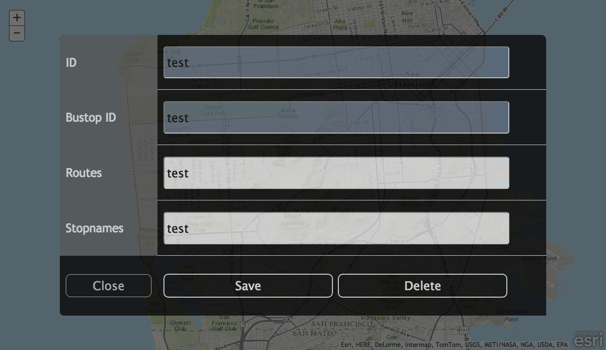

modal-popup-js
==============

A modal popup pattern for mobile GIS, or anything else you want. This sample demonstrates a mobile friendly way to display editable data.

Click [here](http://andygup.github.io/modal-popup-js/) to view it live.

## What does it do?

- The popup is specifically designed for finger-based data entry. It contains large fields and large buttons that work equally well on smaller smartphone screens to larger tablets.

- The popup is modal in that it can either partially or completely hide the content behind it. In this case, I'm using a mapping app. The sample is set for a moderate opacity so that the map is still somewhat visible in the background once the popup is active.

- The popup is built with CSS and uses CSS animation to provide graceful transitions when opening and closing. You can modify any of the CSS settings to meet your tastes or requirements.

## Screenshot

This is the popup in modal mode:

